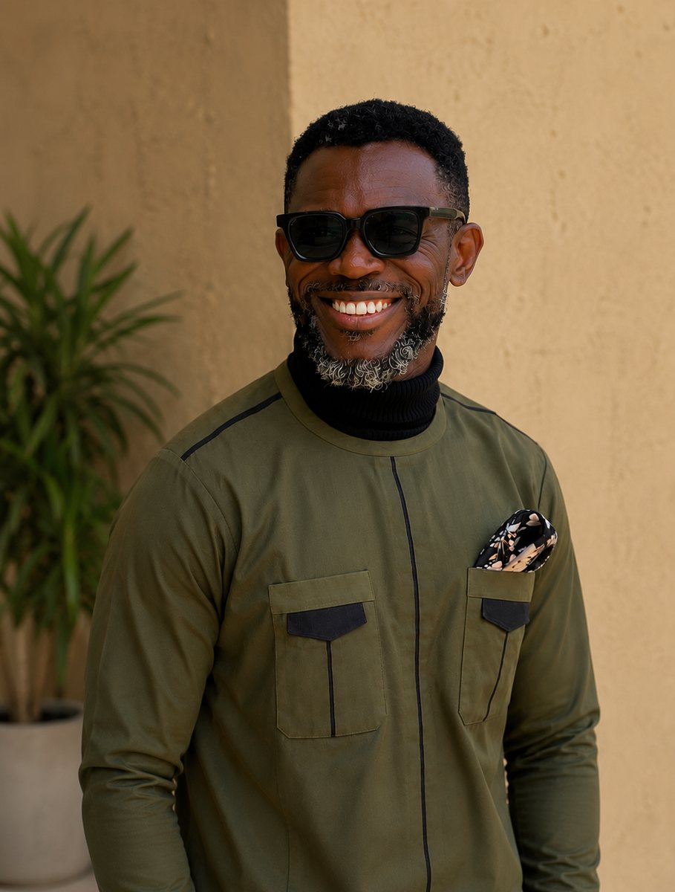

<nav class="site-nav" aria-label="Main navigation">

<a href="index.html">Home</a><a href="projects.html">Projects</a><a href="about.html">About</a><a class="site-nav-cta" href="#contact">Start a conversationContact</a>

</nav>

About Summax<h1>Practical thinking for spaces that matter.</h1>

Summax Global Investment is an Abuja-based team of allied building professionals working across design, construction, renovation and project delivery.

01
<h2>Start with the site. Stay close to the brief.</h2>
Since 2014, Summax has brought together the conversations, drawings, coordination and site work needed to move a building project forward. The approach is direct: understand what the work must do, then make careful decisions that support it.

Objectives<h2>Solutions shaped around the client.</h2>

Summax draws upon its experience and expertise to understand each client’s identity, needs and objectives, then develops creative solutions specific to the project.

Whether the work involves a new facility, renovation, relocation, expansion or consolidation, the team aims to serve as a trusted project adviser—listening carefully, communicating clearly and working toward results that meet a high standard.

<strong>Project relationships</strong>Private developers · corporate bodies · religious institutions · governmental institutions

What we do<h2>One team across the building journey.</h2>

<strong>Design and planning</strong>
Site evaluation, building design, interiors and planting.

<strong>Construction and supervision</strong>
Building works, coordination and site supervision.

<strong>Renovation and maintenance</strong>
Renewal, repair and continued care for existing spaces.

<strong>Project support</strong>
Project management, real estate, furniture and ICT services.

The people behind the work<h2>Experience at the table.</h2>
Engineering, architecture and project coordination brought together from the first conversation through delivery.

<h3>Engr. Chima Nwoke</h3>
Chief Executive Officer

<h3>Arc. Maxwell Ihechineme</h3>
Chief Architect

Have a project in mind?<h2>Let us understand the brief.</h2>
For design, construction, renovation or project support, start with a conversation about the site and the outcome you need.

<a href="mailto:chimanwoke@gmail.com">chimanwoke@gmail.com</a><a href="tel:+2348036009255">+234 803 600 9255</a>Abuja, Nigeria

<footer>Summax Global Investment Limited© 2026</footer>
