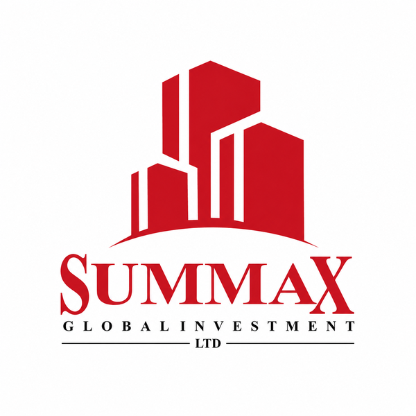
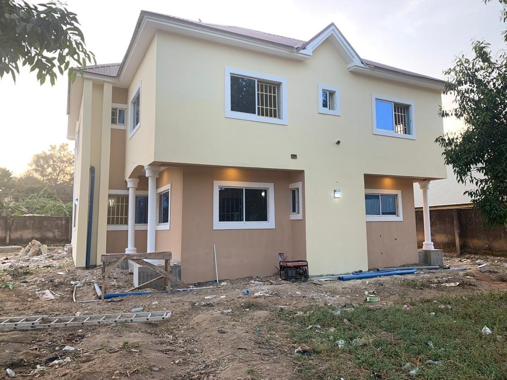
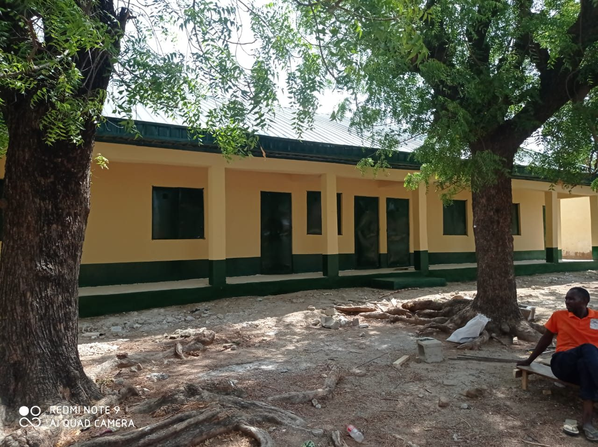
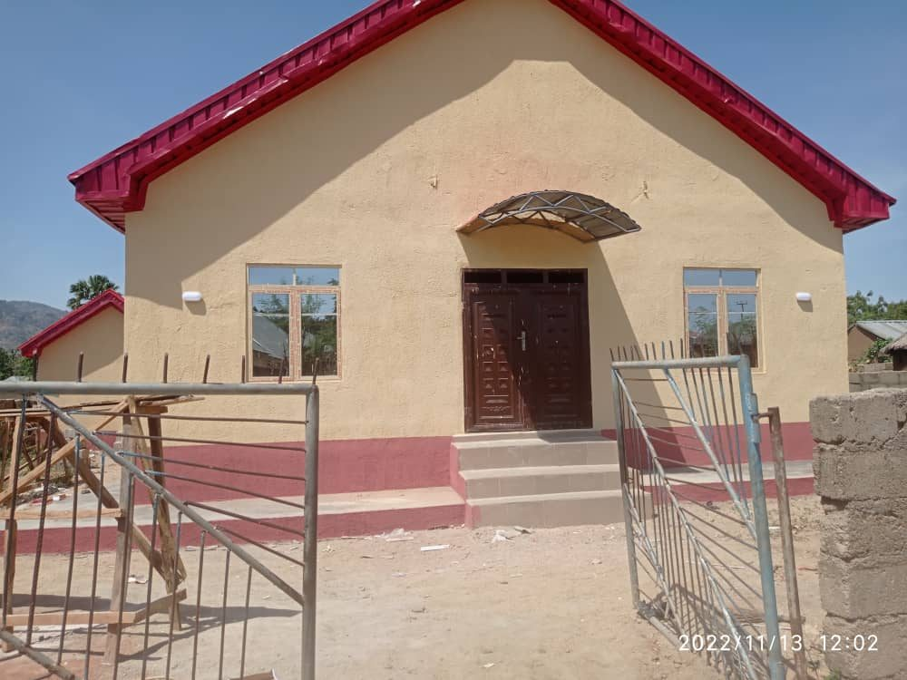
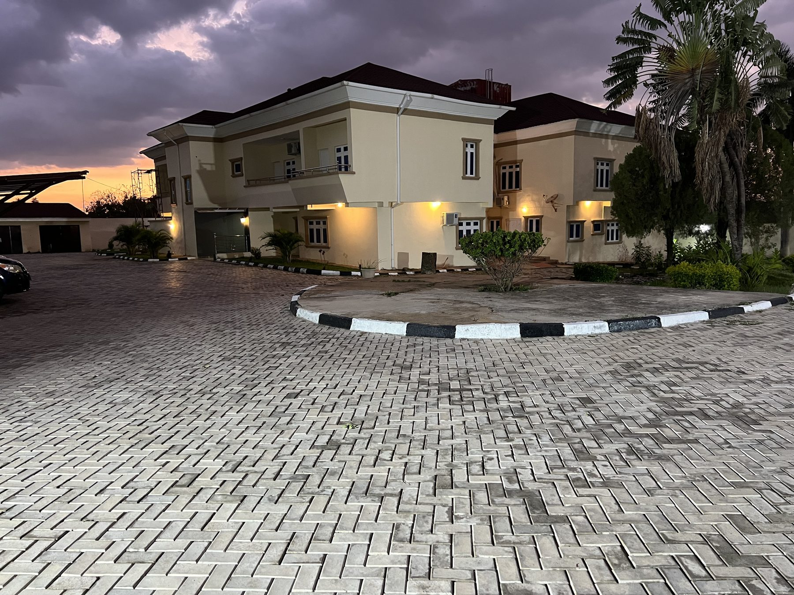
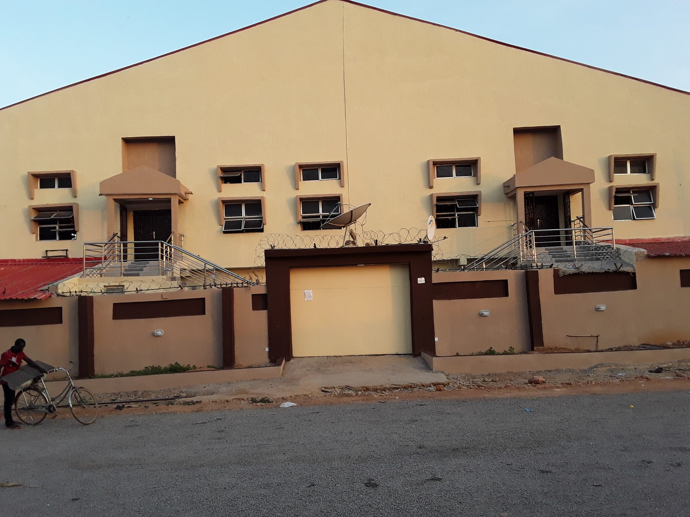
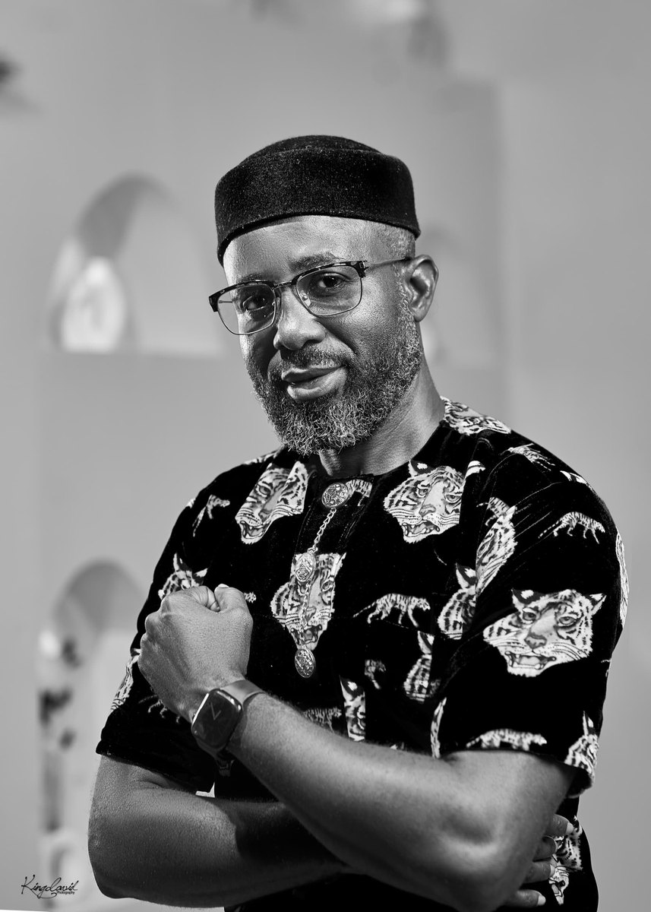
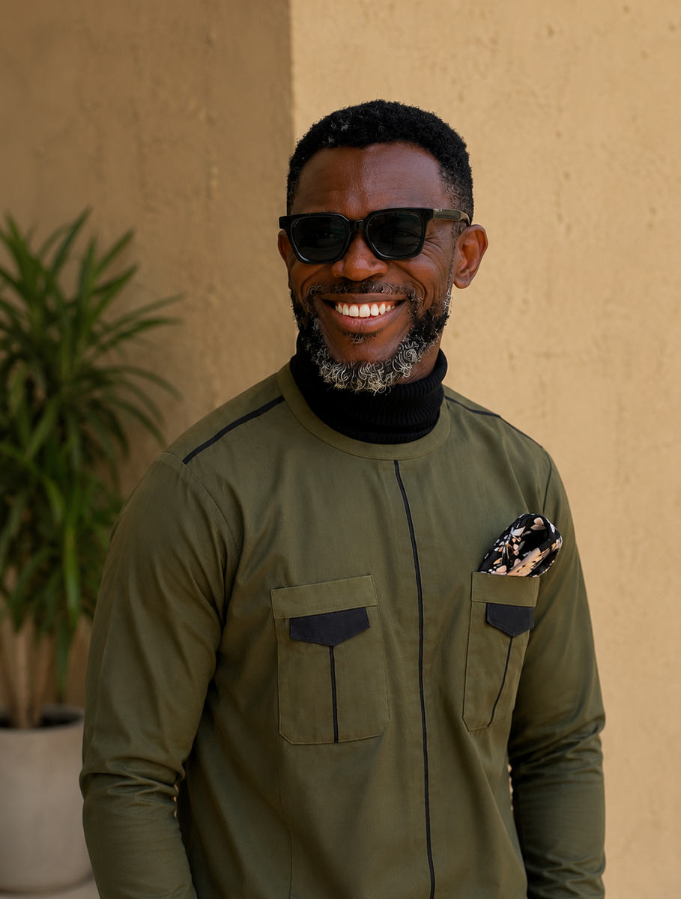

<nav class="site-nav" aria-label="Main navigation">

<a href="index.html">Home</a><a href="projects.html">Projects</a><a href="about.html">About</a><a class="site-nav-cta" href="about.html#contact">Start a conversationContact</a>

</nav>

::: {.hero}
::: {.hero-copy}

Design. Build. Maintain.

# What are you planning to build?

Summax Global Investment is an Abuja-based team of allied building professionals working across design, construction, renovation and project delivery.

::: {.hero-actions}
<a class="button button-primary" href="#projects">View selected work</a>
<a class="text-link" href="#contact">Talk about a project ↗</a>
:::

<strong>Since 2014</strong>Client-led building work across Nigeria

:::

::: {.hero-image}
{.hero-photo fig-alt="Illuminated Mission House project at night"}

Mission HouseJos, Plateau State

:::
:::

::: {.intro-band}

01

<h2>Good work starts with listening.</h2>

Every project begins with the site, the client and the reason the work needs to exist. Summax develops practical solutions around those conditions, then carries them through with care.

:::

<strong>01</strong>Understand the site and the brief

<strong>02</strong>Shape the right design and delivery plan

<strong>03</strong>Stay close through construction and completion

## Services {#services}

::: {.section-heading}
<h2>From first assessment to finished space.</h2>

One team for the decisions that shape a building and the work that brings it into use.

:::

::: {.services-grid}
::: {.service-feature}
01
<h3>Design and planning</h3>

Site evaluation, building design, interior planning and project advice shaped around the brief.

:::
::: {.service-list}

<strong>02</strong>Construction and supervision

<strong>03</strong>Renovation and maintenance

<strong>04</strong>Project management

<strong>05</strong>Real estate and development support

<strong>06</strong>Furniture and ICT services

:::
:::

## Selected work {#projects}

<h2>Built, renovated and still in progress.</h2>

A small selection from the project archive.

<h3>Mission House</h3>
Jos, Plateau State
Construction, interiors and electrical works

<h3>Two-classroom block</h3>
Langtang LGA, Plateau State
Completed

<h3>100-capacity church</h3>
Langtang LGA, Plateau State
Completed

<h3>Office redesigns</h3>
Durumi, Abuja
Interior and building works

<h3>Teens section</h3>
Kaduna
Construction and finishing works

::: {.project-detail}

The working standard<h2>Clear advice. Careful execution.</h2>

Clients rely on Summax for attentive communication, responsive coordination and solutions that respect the brief, the site and the people who will use the finished space.

:::

## The people behind the work {#team}

::: {.team-layout}
::: {.team-intro}
<h2>Experience at the table.</h2>

Summax brings engineering, architecture and project coordination together from the first conversation through delivery.

:::
::: {.team-grid}
::: {.person-card}
{fig-alt="Portrait of Engr. Chima Nwoke"}
<h3>Engr. Chima Nwoke</h3>
Chief Executive Officer

:::
::: {.person-card}
{fig-alt="Portrait of Arc. Maxwell Ihechineme"}
<h3>Arc. Maxwell Ihechineme</h3>
Chief Architect

:::
:::
:::

::: {.contact-panel #contact}

Have a project in mind?
<h2>Let us understand the brief.</h2>

For design, construction, renovation or project support, start with a conversation about the site and the outcome you need.

<a href="mailto:chimanwoke@gmail.com">chimanwoke@gmail.com</a>
<a href="tel:+2348036009255">+234 803 600 9255</a>
Abuja, Nigeria

:::

<footer>

Summax Global Investment Limited
© 2026
</footer>
